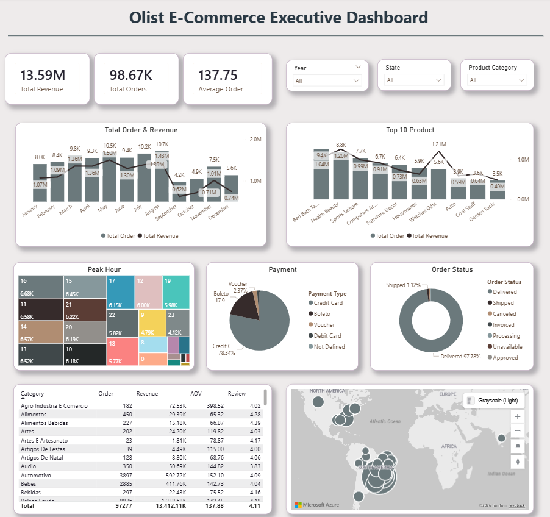
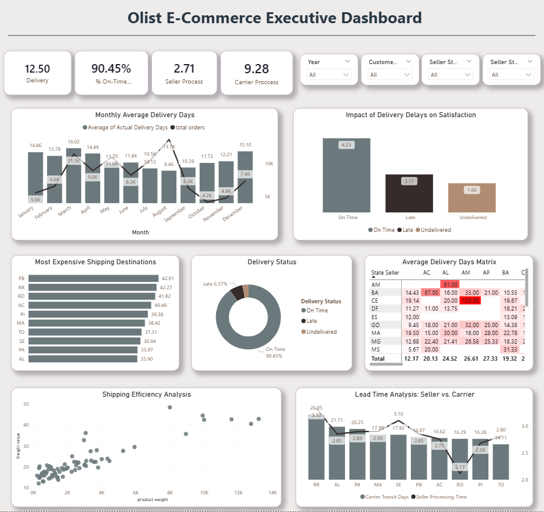
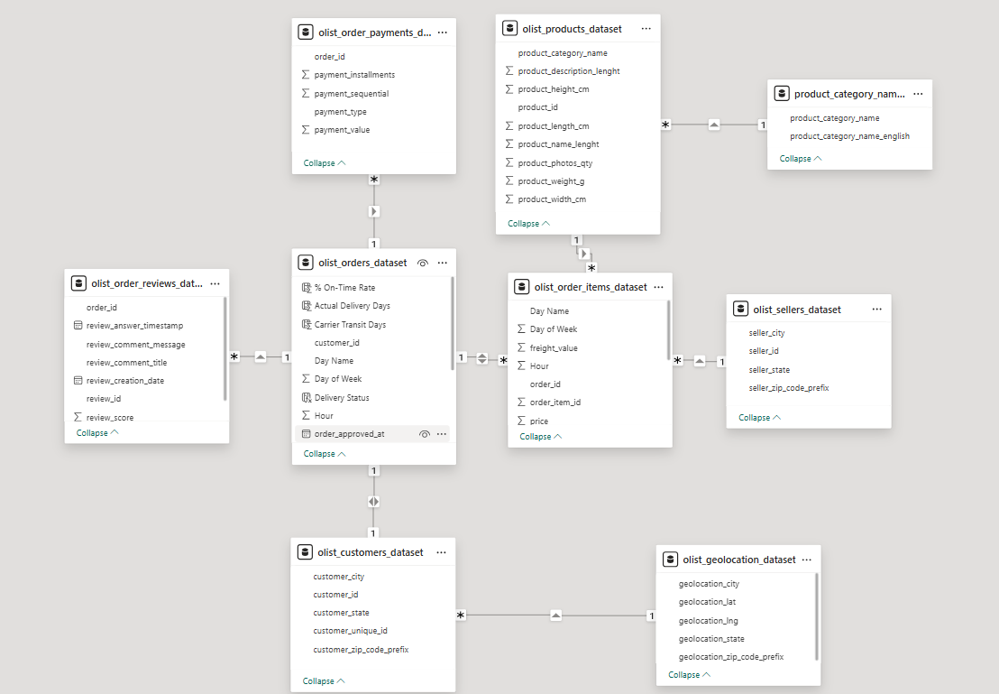

# 🛒 Olist E-Commerce Analytics: Sales & Logistics Optimization


> **Deep dive into Brazilian E-Commerce data to diagnose stagnant customer satisfaction scores and uncover logistics bottlenecks using Microsoft Power BI.**

---

## 📌 Table of Contents

- [Project Overview](#-project-overview)
- [Business Problem](#-business-problem)
- [The Dashboard](#-the-dashboard)
- [Key Insights](#-key-insights)
- [Technical Process](#-technical-process)
- [Project Structure](#-project-structure)
- [Author](#-author)

---

## 📖 Project Overview

This project analyzes a public dataset from **Olist** (a Brazilian e-commerce platform) containing 100k+ orders from 2016 to 2018. The goal is to provide actionable insights into sales performance and operational efficiency.

The analysis is presented in an interactive **Power BI Dashboard** that helps stakeholders understand why customer satisfaction ratings are fluctuating and how logistics impact the bottom line.

🔗 **Live Demo:** [View Interactive Dashboard on NovyPro](https://app.powerbi.com/view?r=eyJrIjoiYWViYmYyOTctMTY3Zi00M2EzLThmNTAtMjkzYTQzMTk1NmFhIiwidCI6ImM3Njc5YmRhLThiOWYtNGMzNC1iZjFmLWU3NjM5MDYwYWJjZSJ9)  
📄 **Case Study:** [Read the Full Article on Medium](https://medium.com/@maulana-irfan/menguak-akar-masalah-logistik-penjualan-pada-olist-e-commerce-menggunakan-power-bi-dcfed9226dd7)

---

## ❓ Business Problem

Despite consistent revenue growth, Olist faces challenges in maintaining high customer satisfaction scores. The management needs to understand:

1.  **Sales Performance:** Which products and regions drive the most revenue?
2.  **Operational Efficiency:** Is the logistics network efficient? Who is responsible for delays (Sellers vs. Carriers)?
3.  **Customer Satisfaction:** How strongly does delivery time correlate with review scores?

---

## 📊 The Dashboard

### Page 1: Sales Overview

Focuses on financial health, customer behavior, and product performance.

_(Note: Replace with your actual image path)_

### Page 2: Logistics & Operations

Focuses on delivery speed, shipping costs, and root cause analysis of delays.

_(Note: Replace with your actual image path)_

---

## 💡 Key Insights

### 1. Logistics is the Bottleneck, Not Sellers

Analysis of the **Lead Time Breakdown** reveals a crucial finding:

- **Seller Processing Time:** Average < 3 days (Highly Efficient).
- **Carrier Transit Time:** Accounts for ~80% of the total delivery duration.
  _Conclusion:_ Delays are caused by the logistics partners/carriers, not the merchants.

### 2. The Cost of Delay

There is a direct correlation between delivery speed and customer ratings:

- ✅ **On-Time Delivery:** Average Rating \*\*4.23 / 5.0
- ❌ **Late Delivery:** Average Rating Drops to **2.17 / 5.0**
  _Conclusion:_ Late deliveries slash customer satisfaction by nearly 50%.

### 3. Geographical Disparity

The **Freight Cost Matrix** shows significant inequality:

- **Northern Regions (RR, PB, AM):** Suffer from the highest shipping costs and longest delivery times (>20 days).
- **Southeast (SP, RJ):** Enjoys fast and cheap delivery.
  _Conclusion:_ Logistics infrastructure is the main barrier to expanding into the Northern market.

---

## 🛠 Technical Process

### 1. Data Cleaning & Modeling (Star Schema)

Transformed 9 separate raw CSV files into a robust **Star Schema** data model to ensure high performance and accurate filtering.

- **Fact Tables:** `Orders`, `Order_Items`
- **Dimension Tables:** `Customers`, `Sellers`, `Products`, `Date`, `Payments`
- **Challenge:** Handled ambiguous geographic relationships by creating separate `Geo_Seller` and `Geo_Customer` tables.



### 2. Advanced DAX Measures

Utilized DAX for complex operational calculations.

**Example: Calculating On-Time Delivery Rate**

```dax
% On-Time Rate =
VAR OnTimeOrders = CALCULATE(
    COUNTROWS('olist_orders_dataset'),
    'olist_orders_dataset'[Delivery Status] = "On Time"
)
VAR TotalOrders = COUNTROWS('olist_orders_dataset')
RETURN
DIVIDE(OnTimeOrders, TotalOrders, 0)
```
